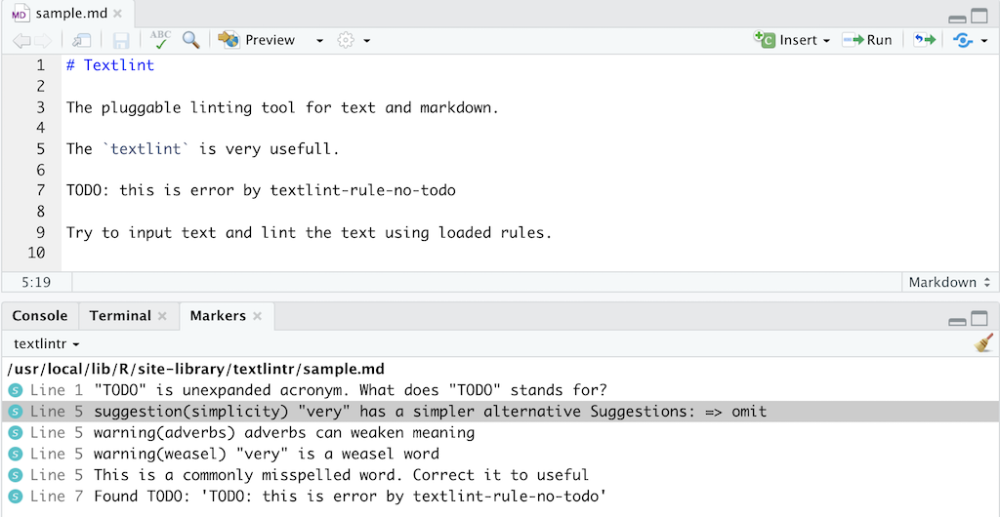

textlintr
=========

[](https://travis-ci.org/uribo/textlintr) [](https://ci.appveyor.com/project/uribo/textlintr) [](https://cran.r-project.org/package=textlintr) [](https://www.tidyverse.org/lifecycle/#experimental) [](https://codecov.io/gh/uribo/textlintr?branch=master)

The goal of textlintr is to ...

Installation
------------

You can install the development version of textlintr from [GitHub](https://github.com/uribo/textlintr) with:

``` r
# install.packages("remotes")
remotes::install_github("uribo/textlintr")
```

Get Started
-----------

### Prepare textlint ecosystems

Textlintr also requires the external program [textlint](https://github.com/textlint/textlint). You may download textlint and custom rules using npm or yarn. Next, just write a `.textlintrc` file.

### Demo

``` r
library(textlintr)

lint_target <- 
  system.file("sample.md", package = "textlintr")

textlint(lint_target)
```

<p align="center">

</p>

## Code of Conduct

The environment for collaboration should be friendly, inclusive, respectful, and safe for everyone, so all participants must obey this repository’s [code of conduct](.github/CODE_OF_CONDUCT.md).
